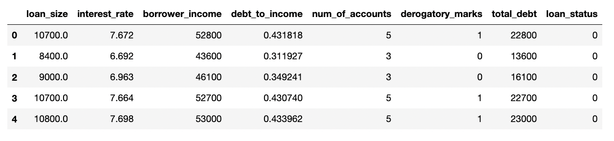
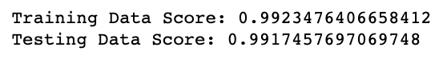
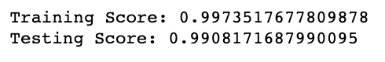

## Credit Risk Evaluator

Classify the Risk of Loan Data using Supervised Machine Learning Models

## Objectives

### Step 1 - Retrieve the Data¶

* Import lending_data.csv using Pandas
* Display the resulting dataframe to confirm the import was successful

### Step 2 - Predict Model Performance

* Compare two models on the data: a Logistic Regression, and a Random Forests Classifier
* Prediction: The Random Forests Classifier will perform better because it uses many subsets of the data to sample and choose the optimal split point for each decision
    * Boosting and Fetaure selection can also contribute to better accuracy and better fit respectively.

### Step 3 - Split the Data into Training and Testing Sets

* Create the features DataFrame, X, by removing the loan_status column
* Create y, the labels set, by using the loan_status column
* Split the data into training and testing datasets by using the train_test_split function

### Step 4 - Create, Fit and Compare Models 

* Create a Logistic Regression model, fit it to the data, and print the model's score

* Create a Random Forest Classifier model, fit it to the data, and print the model's score

* Compare model outcomes
    * Both models performed relatively equally, with scores above 0.99. The Logistic Regression scored slightly better with 0.9917, while the Random Forest Classifier scored 0.9908
    * The predicted model did not score higher, however since both scores were similar, either would be a good representation to model the data

---------------------------------------------------

<b>Contact:</b> bronwynmilne64@gmail.com
